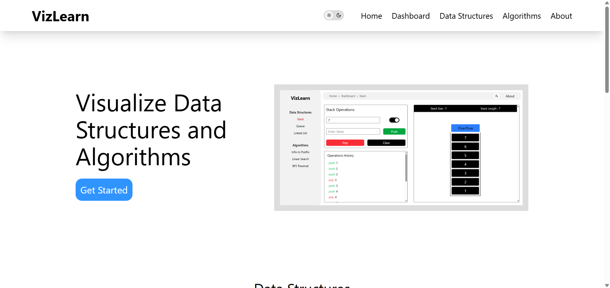
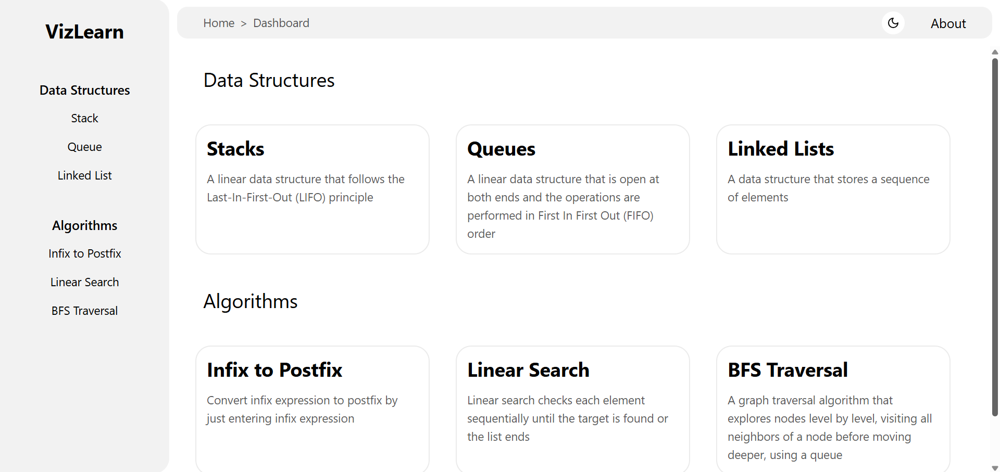
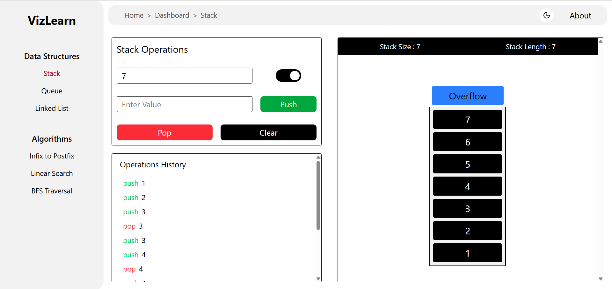
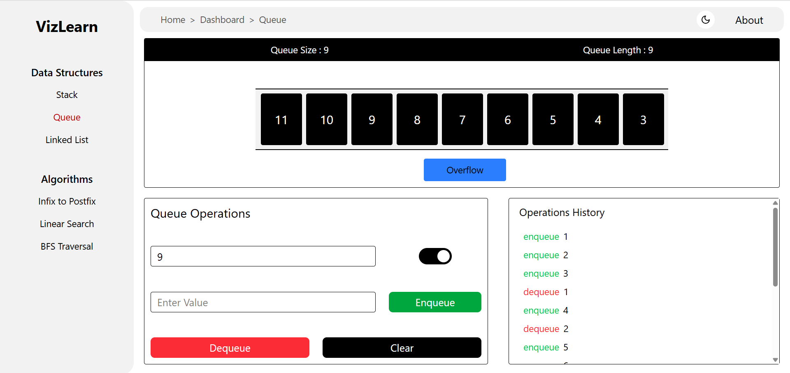
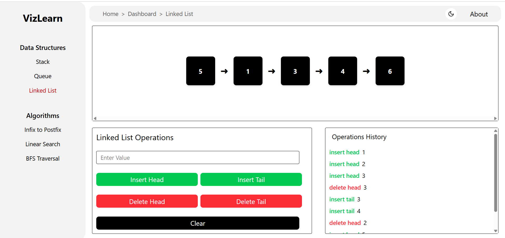
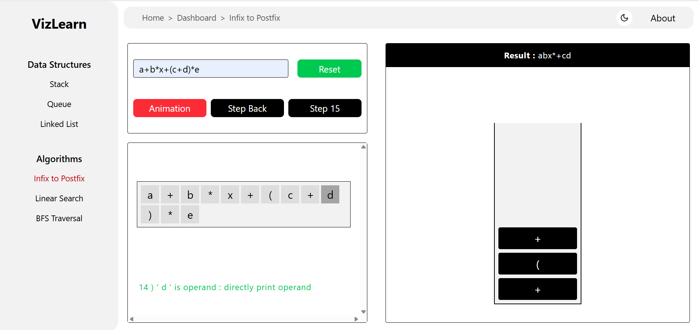
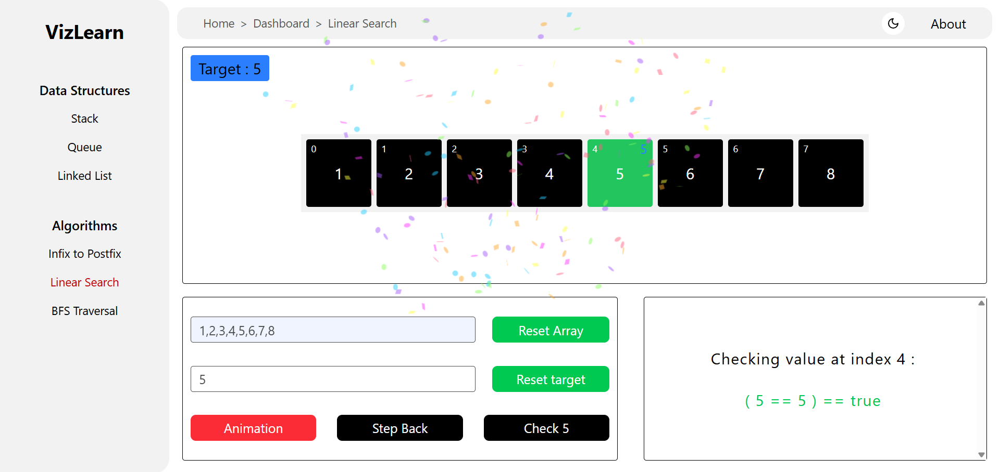

# AlgoFlow - The DSA Visualizer

## 🚀 About

AlgoFlow is an interactive Data Structures and Algorithms (DSA) visualizer designed to help students and developers understand complex concepts through animated visualizations. It provides step-by-step explanations for various algorithms and data structures, making learning more engaging and effective.

## 🌟 Features

📌 **Visualizations for Stack, Queue, and Linked List**.

🛠 **Algorithm animations for Infix to Postfix conversion and Linear Search**.

🏆 **User input support** for customized visualizations.

🎨 **Interactive UI** for a seamless learning experience.

🌗 **Light & Dark Mode support** for better accessibility and user preference.

## 📸 Screenshots

### Home Page & Dashboard

  
  

### Stack, Queue & Linked lists Visualization

  
  
  

### Infix to Postfix & Linear Search Visualization  

  
  

